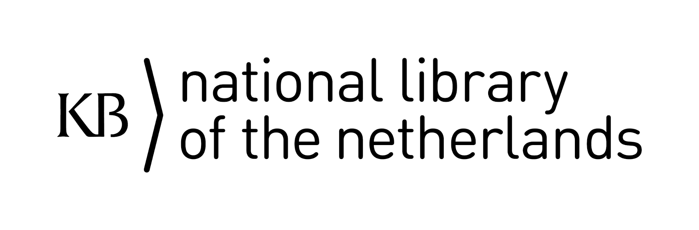

La pre-conferencia del Grupo de Intéres (SIG por sus siglas en inglés) de Bibliotecas y Humanidades Digitales. que se hace en el marco del DH2019, **se celebrará en la Biblioteca Nacional KB de los Países Bajos en La Haya**.

### Sede
La KB es una biblioteca de investigación con una amplia colección en los campos de historia, cultura y sociedad holandesas. Como biblioteca nacional su objetivo es recopilar y almacenar todas las publicaciones (digitales) que se publican en los Países Bajos, así como una parte de las publicaciones internacionales sobre los Países Bajos.

El KB ha planeado digitalizar y aplicar OCR a su colección completa de libros, publicaciones periódicas y periódicos a partir de 1470 en adelante para el año 2030. Más de 70 millones de páginas de libros, periódicos y revistas están disponibles actualmente a través del portal de búsqueda [delpher.nl](delpher.nl) y [dbnl.org](dbnl.org); también ofrece colecciones digitales nativas, como su archivo web, que contiene 33 TB de datos y consta de más de 13,000 sitios web. En 2013, la KB ha configurado el KB Lab para experimentos con la colección digital dentro de las humanidades digitales: [lab.kb.nl](lab.kb.nl)

### Transporte
Los organizadores locales se complacen en acomodar a todos los participantes al organizar el transporte desde Utrecht a La Haya en autobús. Esto está incluido en los costos de registro. Se publicará más información sobre el horario y la ubicación exacta en este sitio web.

La biblioteca está situada junto a la estación central de trenes de La Haya. Si prefiere organizar su propio viaje, consulte [https://www.kb.nl/en/visitors/address-and-directions](https://www.kb.nl/en/visitors/address-and-directions) para obtener direcciones. Para obtener información sobre el horario del tren y cómo comprar los boletos de tren, consulte [https://www.ns.nl/en](https://www.ns.nl/en).

### Contacto
Si tiene preguntas sobre el programa, comuníquese con Sarah Potvin (spotvin [at] library.tamu.edu)

Si tiene preguntas sobre la organización local, comuníquese con Lotte Wilms (lotte.wilms [at] kb.nl)

